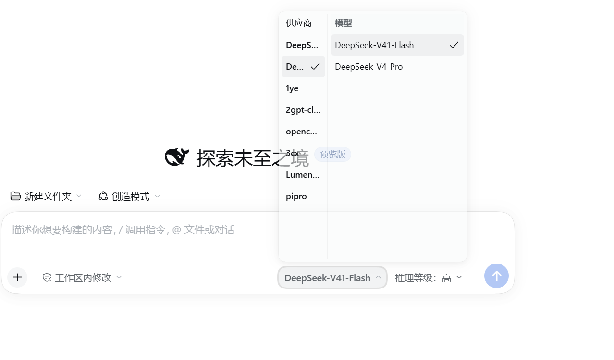

# dsh-personal-model-picker

DSH（DeepSeek Harness）的**紧凑双栏模型选择器**：左栏供应商、右栏模型，鼠标悬停左栏即切换右栏；输入框旁的触发器同时显示当前模型与推理等级。



> **非官方插件**，改编自官方包 `@deepseek-ai/dsh-client-ui-model-selection`（MIT，`Copyright (c) 2026 DeepSeek`），不是 DeepSeek 发布或背书的作品。

## 改了什么

它**替换**官方的模型入口，而不是叠加：bundle patch 先禁用官方 `ui-model-selection` 条目，再插入自己。相对官方，只有下面这些差异，功能语义保持一致。

| # | 变更点 | 官方 | 本插件 |
|---|---|---|---|
| 1 | 供应商 / 模型选择 | 逐级钻取：根菜单 → 该菜单里的模型列表 | **双栏并列**：左供应商、右模型；悬停（或聚焦、点击）左栏即切换右栏，两栏各自滚动 |
| 2 | 面板高度 | 随内容变化 | **固定 348px**（28px 列头 + 320px 模型列 + 卡片内边距），不随悬停供应商的模型数量变化 |
| 3 | 触发器 | 只显示模型名 | 模型名 **+ 推理等级** |
| 4 | 推理等级 | 根菜单里的一行 | 触发器上直接显示当前值，展开为独立一栏 |
| 5 | 与官方共存 | — | **互斥替换**：`cordis.patch.yml` 里 `disabled: true` 官方入口 + `insert` 本插件 |

**没有改的部分**（与官方行为一致）：`/model` 命令照常可用；两个入口共用同一份 per-session 模型目录，从哪个入口改结果都一样；子代理会话一律不可选模型；目录加载失败时按供应商分组列出失败行并可重新加载。

> **为什么高度必须是常量**：面板按**下边缘**定位（`top = 触发器上沿 − 8 − 实测高度`）。高度若跟随悬停供应商的模型数量变化，面板顶边就会上下移动，静止的指针下方随即换成另一个供应商，于是触发换栏、再次改变高度——形成「界面上下乱跳」的反馈环。固定高度后，悬停只切换右栏内容。

**版本与兼容**

- 当前版本 `1.1.1`。已在 DSH 核心 `0.2.0-rc.2`（官方桌面端 nightly）实测通过；原始改编基线为 `0.1.5-rc.2`。
- 图标导出随核心版本改过名：0.1.5 时代是 `IconXxx14` / `IconXxx16`，`0.2.0-rc.2` 起统一为 `IconXxxRegular`。本插件按 `...Regular` 取名——名字对不上时图标取到 `undefined`，React 渲染 `<undefined />` 会抛错，座位项被槽机制除名（`abdicate`），表现为**模型入口整个消失**（而不是样式错乱）。换核时先核对 `@deepseek-ai/dsh-client-ui-primitives` 的实际导出。
- 用词与官方对齐：`推理等级`（官方 `menu.effort`）。

## 怎么安装

1. 在 DSH 当前 profile 的 **Plugins 页**安装，填：

   ```
   github:JuYueYe/dsh-personal-model-picker
   ```

   需要钉死某个版本时加 ref：

   ```
   github:JuYueYe/dsh-personal-model-picker#<commit>
   ```

   安装时插件管理器会把本包追加进该 profile 的 `dsh.profile.bundles` 并默认启用；**仅下载依赖不会启用 bundle patch**，若装完没生效，先确认 bundles 列表里有它。

2. **刷新页面**（Ctrl+R）。打包版里客户端插件的新增不会免刷新生效；若输入框旁仍无变化，重启宿主。

### 更新

依赖规格不带 ref 时，lockfile 会把 commit 钉住，直接重装通常显示 `Already up to date` 而拉不到新提交。任选其一：

```bash
cd <DSH_HOME>/profiles/<profile>
pnpm update dsh-personal-model-picker
```

- 卸载后重装；
- 或用带新 `#<commit>` 的规格安装。

### 卸载 / 回滚

停用该 bundle，或把它从 `dsh.profile.bundles` 移除，然后**重启宿主**，官方模型入口即恢复。本插件只禁用官方那一个 entry、不直接改官方文件，因此移除后不会留下需要手工修复的残留。

## 许可与来源

MIT，版权归上游，完整声明见 [THIRD_PARTY_NOTICES.md](THIRD_PARTY_NOTICES.md)。React 与 DSH 宿主服务由宿主提供，本包不随附另一套运行时。

- 官方元数据：https://registry.npmjs.org/@deepseek-ai%2fdsh-client-ui-model-selection/0.1.5-rc.2
- 上游仓库：https://github.com/deepseek-ai/deepseek-harness → `packages/client/ui-model-selection`

内部实现（界面细节、数据流、边界行为、字典、目录结构、构建与校验）见 [docs/INTERNALS.md](docs/INTERNALS.md)。
